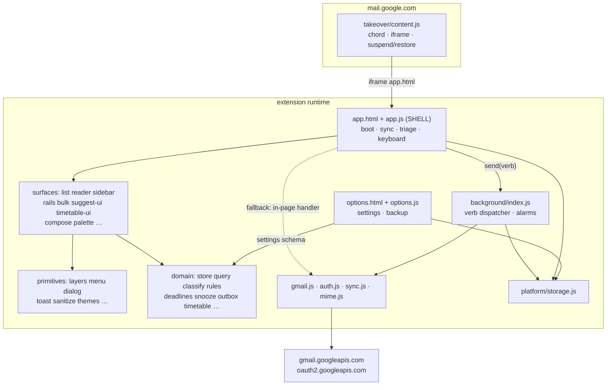
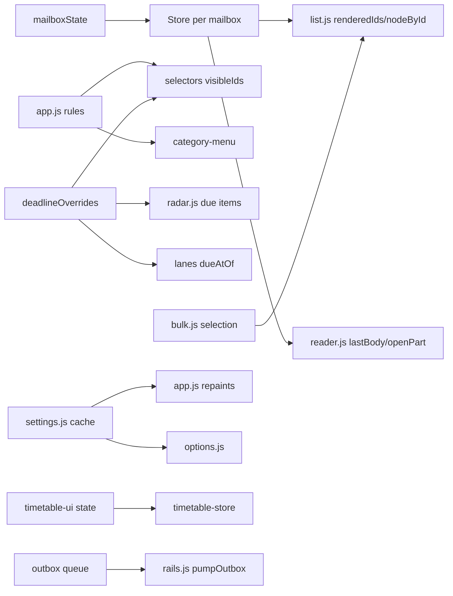

# ARCHITECTURE AUDIT — COMPLETE (Round 55)

**Scope:** the entire repository at `3e67689`, traced from implementation, not
from names or intent. **No fixes were made during this audit.**
**Method:** full file inventory, a machine-extracted import graph (82 modules,
205 internal edges), manifest analysis, boot/flow tracing through the source,
and cross-checking against the 1,501-test suite and `docs/ARCHITECTURE.md`
(the DESIGNED architecture).

Where DESIGNED and ACTUAL differ, both are recorded. Claims carry
file/symbol evidence; unverifiable items are marked **UNVERIFIED**.

---

## PART I — INVENTORY AND ENTRY POINTS

### 1. Complete codebase inventory

#### 1.1 Top level

| Path | Kind | Role |
|---|---|---|
| `manifest.json` | config | MV3 extension manifest: worker, content script, options page, permissions, CSP |
| `app.html` (38KB) | UI shell | The takeover app's single page: sidebar, topbar, panes, tt-workspace, dialogs |
| `options.html` | UI shell | Settings/backup page (opens in tab) |
| `preview.html` (949KB) | generated | `tools/make-preview.mjs` output — self-contained demo build, committed |
| `package.json` | config | `"type":"module"`; scripts; devDeps jsdom/axe-core/pngjs; dep playwright-core |
| `package-lock.json` | lockfile | reproducible installs |
| `.github/workflows/ci.yml` | CI | 4-shard test matrix + checks job (round 53) |
| `icons/` | assets | icon16/48/128 |
| `docs/` | design docs | ARCHITECTURE.md (designed layers), SERVICE-WORKER.md, THREADING.md, TIMETABLE.md, CLASSIFICATION_DATA_PACK.md (source of generated rules), EXTENSION-KEY.md, BUILD-PLAN.md |
| `audits/` | audit history | 50+ audit documents incl. this one and the round-51 UI map |
| `notes/` | working notes | scratch |
| `src/` | source | 82 JS modules across 7 contexts (below) |
| `test/` | tests | 62 `*.test.mjs` + `helpers/` (storage.mjs, worker-contract.mjs) + bench.mjs |
| `tools/` | tooling | 20 scripts (below) |
| `README.md`, `SECURITY.md`, `FIXING.md`, `TODO.md`, `DO-THIS-NOW.md`, `CONTRIBUTING.md` | docs | product/security/ops |

#### 1.2 Source contexts (`src/`)

Five execution contexts share one source tree:

| Context | Entry | Loads |
|---|---|---|
| Service worker | `src/background/index.js` (manifest `background.service_worker`, `type: module`) | 11 direct imports |
| Content script | `src/takeover/content.js` (manifest `content_scripts`, `document_idle` on `mail.google.com`) | standalone, no imports |
| App page | `app.html` → `src/app/app.js` (module script) | 47 direct imports |
| Options page | `options.html` → `src/options/options.js` | app-layer modules directly |
| Node (tests/tools) | `node --test`, `tools/*.mjs` | anything |

Directory purposes:

| Dir | Contents | Architecture role |
|---|---|---|
| `src/app/` | 60 modules | UI shell + surfaces + domain + some persistence (see §3) |
| `src/background/` | index.js (694), gmail.js (980), auth.js (444), sync.js (209), mime.js (163), notify.js (47) | worker: network, OAuth, Gmail API, alarms |
| `src/classify/` | index.js (230), pattern-rules.js (1059, generated), sender-rules.js (365), address-map.js (189, generated), sender.js (127), scoring.js (109), categories.js (109) | pure classification domain |
| `src/platform/` | storage.js (49) | the ONLY chrome.storage wrapper |
| `src/shared/` | labels.js (10), limits.js (22) | worker+app shared constants |
| `src/takeover/` | content.js (411), takeover.css | Gmail-page side of the takeover |
| `src/options/` | options.js (534) | settings/backup UI |
| `src/timetable/` | data.json + sources/ | the scraped catalogue data |

#### 1.3 Module register (all 82, grouped by actual role)

Evidence: import graph extraction (script: static-import parse of `src/**`).
Lines from `wc -l`. "Consumers" = fan-in from the graph.

**Shell & orchestration**

| Module | Lines | Responsibility | Key state | Consumers |
|---|---|---|---|---|
| `app/app.js` | 3332 | Composition root: boot, worker bridge (`send`), sync engine (`refresh`, `opEpoch`), mailbox switching, triage verbs (`act`/`optimistic`/`flagAction`), keyboard, theme menu, gate, offline/worker banners, the `ctx` object | `stores` Map, live `store` binding, `mailboxState`, `state` object, `rules`, `deadlineOverrides`, `followupList`, `enrolment`, `automationRules` | — (root) |

**UI surfaces (workspace extraction, rounds 51–52)**

| Module | Lines | Responsibility | Owns |
|---|---|---|---|
| `app/list.js` | 1088 | diff-render of the message list, rows, empty/skeleton states, travel ghost, scroll memory, list wiring | `renderedIds`, `nodeById`, `firstPaint`, scroll vars |
| `app/reader.js` | 931 | reading pane: head/tags/banners, thread strip, sandboxed body iframe, attachments, image policy, mark-read timing | `bodyToken`, `lastBody`, `openPart`, `markReadTimer`, `imageAllowList`, `readPosition` |
| `app/sidebar.js` | 344 | mailbox/category rail, counts, freshness, roving tabindex, rail wiring | nothing persistent |
| `app/rails.js` | 295 | snoozed rail, outbox rail, outbox pump loop, lane headers | `outboxTimer`, `pumpFailedNotified`, `newlyStuck` |
| `app/bulk.js` | 343 | `Selection` instance, bulkbar render, chunked bulk protocol, j/k `move()` | `selection` |
| `app/suggest-ui.js` | 241 | search combobox | `suggestions`, `suggestIndex`, `queryHistory`, `suggestBlurTimer` |
| `app/timetable-ui.js` | 1338 | timetable WORKSPACE (round 54): build wizard + manage view + tabs + scan/apply UI | `state` (timetable), `source`, `pending` findings, `tab`, `ctxRef` |
| `app/compose.js` | 786 | compose panel, recipients, attachments, drafts wiring, send flow | panel DOM state |
| `app/palette.js` | 356 | command palette (Ctrl+K) | open layer |
| `app/activity-ui.js` | 88 | activity log layer | — |
| `app/help.js` | 44 | help overlay tenant | `helpLayer` |
| `app/snooze-menu.js` | 50 | snooze preset picker | ctx |
| `app/category-menu.js` | 55 | mute/auto-archive menu | ctx |
| `app/saved-views.js` | 159 | saved-views rail render + persistence handling | — |
| `app/bulkbar.js` | 48 | bulkbar wiring tenant | — |
| `app/notices-rail.js` | 62 | academic notices rail tenant | — |
| `app/autocomplete.js` | 153 | recipient autocomplete | contacts cache |
| `app/features.js` | 56 | BARREL re-exporting undo/radar/palette/compose/autocomplete (historical) | — |

**UI primitives**

| Module | Lines | Responsibility |
|---|---|---|
| `app/layers.js` | 286 | overlay stack primitive: `openLayer`/`closeLayer`/`closeTopLayer`/`closeAllLayers`, focus trap, exit motion |
| `app/menu.js` | 257 | anchored popup menu primitive |
| `app/dialog.js` | 212 | in-app confirm/prompt dialogs (replaces `confirm()`/`prompt()`) |
| `app/toast.js` | 101 | toast queue with drain line |
| `app/dom.js` | 27 | guarded `setText`/`setAttr` (no write if unchanged) |
| `app/icons.js` | 134 | the 14-icon SVG set + `middleTruncate` |
| `app/themes.js` | 239 | 6 themes as data; WCAG pairs consumed by contrast tooling |
| `app/display.js` | 86 | pure display mappings shared by list+reader (`CAT_COLOR`, `displayName`, dates, `LOW_CONFIDENCE`) |
| `app/shortcuts.js` | 124 | shortcut table data for help |
| `app/reader-frame.js` | 50 | reader body-iframe contract: typography table + CSP builder |
| `app/sanitize.js` | 352 | HTML sanitiser for mail bodies (security boundary) |

**Domain (pure or storage-only; no chrome.\*, no DOM except marked)**

| Module | Lines | Responsibility |
|---|---|---|
| `app/store.js` | 597 | the mailbox Store: indexed messages, threading, search, counts, subscribe/batch |
| `app/query.js` | 545 | query parser (`is:`, `from:`, dates, grouping) |
| `app/selectors.js` | 114 | visible-ids selection (mailbox/category/query/mute/thread collapse) |
| `app/mailboxes.js` | 154 | mailbox definitions, per-mailbox action tables |
| `app/rules.js` | 251 | category rules store (mutes, auto-archive, corrections) |
| `app/rule-engine.js` | 349 | automation rules (condition→action batches) |
| `app/deadlines.js` | 330 | deadline extraction from mail text |
| `app/deadline-store.js` | 262 | deadline overrides persistence + due-at resolution |
| `app/followups.js` | 211 | follow-up tracking (awaited replies) |
| `app/snooze.js` | 169 | snooze schedule store (used by app AND worker — declared edge) |
| `app/outbox.js` | 506 | send queue model + shared flush runner (used by app AND worker — declared edge) |
| `app/contacts.js` | 177 | sender address book derivation |
| `app/selection.js` | 216 | the Selection data structure (multi-select, ranges, threading) |
| `app/lanes.js` | 221 | triage lane assignment predicates |
| `app/snippet.js` | 279 | snippet cleaning (salutations/disclaimers/quotes stripped) |
| `app/suggest.js` | 254 | search suggestion generation + history |
| `app/views.js` | 203 | saved views persistence |
| `app/templates.js` | 273 | reply/forward templates |
| `app/notices.js` | 271 | academic notice detection/promotion |
| `app/my-courses.js` | 239 | enrolment store + course chips |
| `app/timetable.js` | 1102 | timetable pure model (entries, conflicts, week view, exams) |
| `app/timetable-store.js` | 206 | timetable persistence + catalogue access |
| `app/timetable-mail.js` | 517 | academic-mail scanning for timetable changes |
| `app/direct.js` | 151 | "direct mail" audience detection |
| `app/undo.js` | 116 | UndoStack primitive |
| `app/undo-actions.js` | 67 | `recordUndo`/`performUndo` (toast wiring) |
| `app/server-search.js` | 139 | server-side search fallback orchestration |
| `classify/*` | 2330 total | classification: patterns+senders→category+confidence (pure) |

**Platform / infrastructure**

| Module | Lines | Responsibility |
|---|---|---|
| `platform/storage.js` | 49 | the one `chrome.storage.local` wrapper (graceful degradation when absent) |
| `app/settings.js` | 295 | settings SCHEMA + typed accessors + cross-page change following |
| `app/cache.js` | 365 | message cache (warm starts) with size cap |
| `app/fallback.js` | 340 | in-page degraded runner: dynamically imports background modules when the worker is dead |
| `background/index.js` | 694 | worker root: verb dispatcher, alarms, lifecycle |
| `background/gmail.js` | 980 | Gmail REST adapter (threads, messages, labels, modify, send, attachments) |
| `background/auth.js` | 444 | OAuth (chrome.identity) + token management |
| `background/sync.js` | 209 | page/delta sync shaping |
| `background/mime.js` | 163 | MIME parsing (bodies, inline parts, attachments) |
| `background/notify.js` | 47 | desktop notifications |

#### 1.4 Tools

| Tool | Role |
|---|---|
| `ci-test.mjs` | CI runner: skip-fails rule, crash detection, `--shard i/n`, TEST SUMMARY blocks |
| `coverage-gate.mjs` | coverage gate |
| `visual-regression.mjs` | browser screenshot diffing (playwright-core, optional) |
| `check-contrast.mjs` | WCAG AA audit of every theme (also runs in CI) |
| `gen-pattern-rules.mjs` / `gen-address-map.mjs` | regenerate `classify/pattern-rules.js` / `address-map.js` from `docs/CLASSIFICATION_DATA_PACK.md` (CI asserts no-op) |
| `mutate.mjs` | mutation testing harness |
| `doctor.mjs`, `why.mjs`, `verify-here.mjs` | local diagnostics |
| `make-preview.mjs` | builds `preview.html` |
| `make-icons.py`, `make-bisect.mjs`, `time-tests.mjs`, `paste-into-devtools.js`, `sw-probe/` | assets/bisect/timing/debug |
| `parse-timetable.mjs` | catalogue scraper/parser |

### 2. Entry points (every real start of execution)

**E1 — Service worker** (`src/background/index.js`, manifest `background`).
Started by Chrome on install/message/alarm. Initializes: message listener
(`chrome.runtime.onMessage` → `handle()` verb switch, ~30 verbs listed in
§I.2-below), `chrome.alarms.onAlarm` (lines 665+), `action.onClicked`,
install-time label bootstrap. Creates no UI state. Owns the OAuth token, the
Gmail API client, the snooze WAKE_ALARM (`armWake`, lines 575–583) and the
periodic SYNC_ALARM (line 661). Anything in the app reaches it only through
`send(type, extra)` → `chrome.runtime.sendMessage`.

Worker verbs (evidence: `case '` at lines 202–465): AUTH_STATUS, SIGN_IN,
SIGN_OUT, PROFILE, SYNC_PAGE, SYNC_DELTA, GET_BODY, MARK_READ, MARK_UNREAD,
STAR, ARCHIVE, TRASH, BULK, UNARCHIVE, UNTRASH, SPAM, NOT_SPAM, SEND,
GET_DRAFT, SAVE_DRAFT, OUTBOX_PUMP, LIST_LABELS, CREATE_LABEL, SNOOZE,
UNSNOOZE, WAKE_DUE, GET_ATTACHMENT, GET_INLINE.

**E2 — Content script** (`src/takeover/content.js`, `document_idle` on Gmail).
Listens: Alt+Shift+M chord (`isTrustedChord`, line 386 — source-checked),
extension `commands` toggle, `message` events from the app iframe.
`takeOver()` (line 231) creates the full-page iframe of `app.html`, suspends
Gmail's DOM (`suspendGmail`, line 117), waits for `BMM_READY` (line 199+,
2s timeout), then reveals. `release()` (line 300) reverses. State: one
`frame` reference; no storage access.

**E3 — App page** (`app.html` → `app.js`). Boots at the file's end:
`IS_EMBEDDED && !EMBED_NONCE` → refuse-and-blank; else `boot()`. `boot()`
(app.js:3023) phase order (traced):

```
settings.loadSettings()           (cache must be warm before any sync read)
settings.followExternalChanges()  (options-page writes arrive live)
settings.subscribe(threaded/density/lanes repaints)
theme + density applied            (before first paint)
initToast(...)
wireList → wireRails → wireSidebar → buildSidebar/renderSidebar
wireSuggestUI → wireReader → wireSnoozeMenu → wireCategoryMenu
wireNotices → wireBulk → wireBulkbar → views wiring → wirePalette
wireCompose → wireRadar → reader-idle click → wireServerSearch → wireViews
compose/timetable buttons → renderList → BMM_READY to content script
AUTH_STATUS → showGate('') if signed out  (boot ENDS here for guests)
coach toast → loadRules → loadImageAllowList → start()
restoreDraftIfAny(ctx)
```

`start()` (app.js:2943) does the first `refresh()` + cache hydrate +
timetable init + outbox pump arm + auto-refresh schedule.

**E4 — Options page** (`options.html` → `src/options/options.js`). Renders
settings from the settings SCHEMA, persists via `settings.set` through its
`persist()` wrapper (the designated surface for settings failures), hosts
backup export/import (`app/backup.js`).

**E5 — Tests** (`node --test test/`, 62 files). The two integration files
boot the REAL app per test: `app.js` is imported with a cache-busting
`?t=${Math.random()}` URL (fresh module state), while every other module is
cached — hence the `_reset*` seam family (§16 INV-12).

**E6 — Tools/CI**: `ci-test.mjs` (4 shards), generators, contrast, VR,
mutation, coverage. Each is a standalone node entry.

**E7 — Alarms** (worker re-entry): WAKE_ALARM → due snoozes are unsnoozed +
notified; SYNC_ALARM → background refresh (delta) and, for the open app, the
app's own `scheduleAutoRefresh` (app.js:2728) is the foreground path.

---

## PART II — LAYERS, DEPENDENCIES, MAPS

### 3. Architecture layers (ACTUAL, verified against the import graph)

`docs/ARCHITECTURE.md` declares four layers (SHELL → FEATURES → DOMAIN →
PLATFORM, dependencies downward only, enforced by tests). The ACTUAL layering
matches with one documented evolution: FEATURES split into "surfaces" and
"primitives" during rounds 46–52, and two DOMAIN stores (`snooze.js`,
`outbox.js`) have DECLARED upward edges into the worker.

```
┌─────────────────────────────────────────────────────────────────┐
│ SHELL        app.js (3332), app.html                            │
│              boot, worker bridge, sync engine, mailbox routing, │
│              triage verbs, keyboard, gate, the ctx object       │
├─────────────────────────────────────────────────────────────────┤
│ SURFACES     list reader sidebar rails bulk suggest-ui          │
│              timetable-ui compose palette activity-ui help      │
│              snooze-menu category-menu saved-views bulkbar      │
│              notices-rail autocomplete                          │
│              talk to the shell ONLY through ctx                 │
├─────────────────────────────────────────────────────────────────┤
│ PRIMITIVES   layers menu dialog toast dom icons themes display  │
│              shortcuts reader-frame sanitize                    │
├─────────────────────────────────────────────────────────────────┤
│ DOMAIN       store query selectors mailboxes rules rule-engine  │
│              deadlines deadline-store followups snooze* outbox* │
│              contacts selection lanes snippet suggest views     │
│              templates notices my-courses timetable{,-store,    │
│              -mail} direct undo{,-actions} server-search        │
│              classify/* (pure, worker-safe)                     │
├─────────────────────────────────────────────────────────────────┤
│ PLATFORM     platform/storage, settings, cache, background/*,   │
│              fallback, shared/*                                 │
└─────────────────────────────────────────────────────────────────┘
        * declared worker edges (architecture.test.mjs enforces the list)
```

Layer rules and their enforcement (ACTUAL):

- **background ⇏ app** except the declared edges `snooze.js` + `outbox.js`,
  symbol-limited — `test/architecture.test.mjs` ("background never imports
  app statically — except the declared store helpers").
- **app ⇏ background** never statically; the single dynamic exception is
  `fallback.js`'s `import('../background/auth.js')` etc., pinned in the same
  test ("fallback dynamic import preserved").
- **classify is pure** (no DOM/chrome) — load-doctor tests in
  `package.test.mjs` reject DOM usage in worker-reachable files (round 50's
  course-code regex was kept local to the worker for exactly this reason).
- **One storage wrapper**: 18 modules import `platform/storage.js`; no module
  calls `chrome.storage` directly (verified by the architecture suite and the
  secrets scanner).

Violations found: none against the declared rules (§17 lists the structural
weaknesses that are NOT rule violations).

### 4. Dependency map (machine-extracted)

82 modules, 205 internal edges, **0 circular dependencies** (DFS over the
static-import graph).

**Fan-in hotspots** (most depended-upon):

```
18  platform/storage.js     ← every persistence path funnels here
10  app/icons.js
 9  app/contacts.js         ← addressOf is used by compose, rails, suggest, classify-adjacent paths
 8  app/layers.js           ← every overlay tenant
 8  classify/categories.js  ← vocabulary shared by app + worker
 7  app/settings.js
 5  dom.js / deadlines.js / query.js / deadline-store.js / display.js
 4  activity.js / toast.js / menu.js / mailboxes.js / snooze.js / background/gmail.js
```

**Fan-out hotspots** (heaviest dependers):

```
47  app/app.js        ← composition root; expected, but the widest fan-out
17  app/reader.js
14  app/list.js
11  background/index.js
10  app/compose.js
 8  app/sidebar.js     7  rails.js     6  bulk.js
```

**Notable chains and why they exist**

- `app.js → reader.js → rails.js?` NO — reader imports `timetable-ui.js`
  for `timetableEffectsOf` (the reader banner shows what a message did to the
  timetable). One-way; timetable-ui never imports reader.
- `list.js → rails.js` for `insertLaneHeaders`: lanes are rail furniture the
  list asks for when the setting is on; rails never reads list state.
- `sidebar.js → list.js` (`setCount`, `collapseThreads`): the rail must count
  exactly what the list shows (conversation-collapse agreement, R-6).
- `bulk.js → list.js` (`renderedIdsOf`, `nodeByIdOf`, `reorientTo`): j/k and
  bulk walk the rendered index; the accessor pair replaced a shared scope.
- `suggest-ui.js → saved-views.js + palette.js`: suggestions include views
  and label names; both are data-only reads.
- `background/index.js → snooze.js/outbox.js`: the wake alarm and the send
  pump must run where the user is NOT looking; both modules are storage-only
  (no DOM), which is what makes the edge legal.
- `fallback.js → background/{auth,gmail,sync,mime}` (dynamic): when the
  worker is dead the page degrades to running the same handlers in-page —
  dependency inversion by emergency, deliberately dynamic so a healthy
  session never pays for it.

**Hidden coupling** (imports do not show these):

- `app.html` element IDs are the contract between markup and ~20 modules
  (`$('search')`, `$('r-body')`, `$('tt-panel')`…). Renaming an ID is a
  cross-module break with no compiler; `layout-contract.test.mjs` pins the
  structural ones.
- Storage key strings are the cross-CONTEXT contract (worker writes, app
  reads) — unified where a shared module owns them (`snooze`, `outbox`,
  `timetable`), ad-hoc otherwise (`imageAllow`, `queryHistory`…) — §17 M-1.
- The `ctx` object (app.js:2807) is the inversion seam for every surface;
  its shape is documented in `features.js`'s typedef and in each module's
  `wire*` JSDoc.

### 5. Architecture maps

#### A. System-level map (ACTUAL)



#### B. Runtime flow map (boot → steady state)

```
content.js chord/toggle → takeOver() → iframe(app.html) → app.js boot()
  → settings warm → wire all surfaces (ctx seams) → renderList/renderSidebar
  → BMM_READY → content.js reveals (Gmail suspended underneath)
  → AUTH_STATUS ─┬─ signed out → showGate → doSignIn → SIGN_IN(worker/OAuth)
                 └─ signed in  → start(): cache hydrate → refresh()
refresh(): SYNC_DELTA or SYNC_PAGE(worker) → ingest()
  → classify (worker-safe pure) → shapeRecords → store.batch(upsert)
  → applyRules(autoArchive/corrections) → withDeadline extraction
  → store notify → scheduleRender(rAF) → renderList+renderSidebar+radar+views
steady state: autoRefresh timer · outbox pump re-arms · alarms in worker
```

#### C. State ownership map (§7 detail) — who owns / reads / mutates



#### D. Data-flow map (mail)

```
Gmail API (worker) → SYNC_PAGE/SYNC_DELTA raw JSON
→ sync.js shaping → app.js ingest()
→ classify(msg) → {category, confidence, source, reason}
→ shapeRecords → {id, threadId, from, subject, snippet, date, unread,
   starred, category…, dueAt/dueKind/dueText, courses}
→ Store.upsert (indexes: order, byCategory, threads, search tokens)
→ store.batch notify (once) → scheduleRender (once per rAF)
→ list.js fillRow → DOM row        reader.js openMessage → iframe srcdoc
```

#### E. Event-flow map

```
sources: DOM (delegated: one click listener on #list, one on #cats,
         keydown on document), chrome.runtime messages, storage.onChanged
         (settings), alarms, postMessage (content↔app, source-checked)
handlers: app.js keydown ladder · list click/star/pick/shift/ctrl ·
          surfaces' own wiring (wire*)
side effects: store mutation → notify → rAF render · send(verb) → worker
              → Gmail · storage writes · toast/activity records
```

#### F. Persistence map (§G in §7) — every key in §7.3.

#### G. UI architecture map (post round-54)

```
app.html
├── #sidebar            (app nav: brand/freshness · views · categories ·
│                        snoozed/outbox/radar rails · compose/timetable/
│                        back-to-gmail/sign-out)
├── #main
│   ├── #topbar         (search combobox · theme · density · help)
│   ├── #panes          (#listpane + reader/#reader-empty)   ← MAIL surface
│   └── #tt-workspace   (#tt-panel: tabs Schedule/Changes/Conflicts/Exams)
│                                                        ← TIMETABLE surface
├── #compose #palette #help #gate      (fixed overlays/dialogs)
└── body-level: layers (menus/dialogs/log), toast, offline banner
```

#### H. External integration map

```
app.js send(verb) ─ chrome.runtime ─ background handle() ─ gmail.js ─ HTTPS
                                        │ (token via auth.js/chrome.identity)
worker dead → send() falls back to runInPage (fallback.js builds the SAME
handler table from dynamic imports; claim-guarded)
content script ↔ app: postMessage BMM_READY / BMM_SHOWN / BMM_RELEASE,
all source-checked (e.data.source === parent)
```

#### I. Test architecture map (§13 detail).

---

## PART III — BEHAVIOR: FLOWS, STATE, DATA, CONTROL, ASYNC, ERRORS, CONFIG

### 6. Major user flows traced end to end

**F1 — Sign in.** `doSignIn` (app.js:2247) → `send('SIGN_IN')` →
worker `auth.signIn()` (chrome.identity.getAuthToken, OAuth against
oauth2.googleapis.com) → PROFILE fetch → app: `hideGate`, `start()`.
Failure: gate error text; `reportError` (app.js:1494) classifies
network/auth shapes into recovery copy.

**F2 — Sync.** `refresh({silent})` (app.js:1397) → delta attempt
`send('SYNC_DELTA')` (history-id based, worker sync.js) → on cursor expiry:
full `SYNC_PAGE` + `resetView()` → `ingest(messages)` (app.js:1158):
classify → `shapeRecords` → `store.batch` upserts → `applyRules`
(app.js:1202: auto-archive + sender corrections via rule-engine) →
`withDeadline` (deadline extraction stamped on the record). Store notifies
ONCE (batch), `scheduleRender` coalesces to ONE rAF. New-mail announcement:
`announceNew(n)` in list.js (pill if scrolled deep, else toast). After a
full sync: `pruneAfterFullSync` (app.js:1850) sweeps
overrides/mutes/follow-ups for threads that left — guarded by store
completeness (V2 P2-22, pinned in rules.test.mjs).

**F3 — Open a message.** row click (list.js delegated handler) →
`ctx.openMessage(id)` → reader.js `openMessage`: store lookup (+
server-search overlay merge via `overlayGet`), patchRow on prev/current,
aria-activedescendant, swap animation skip when stepping fast (`lastSwapAt`
< 200ms), tags + recat affordance, `renderMessageDeadline`,
`renderTimetableEffects`, mark-read grace timer (settings delay, cancelled
by close/navigation via `bodyToken`), thread strip, `loadBody`
(GET_BODY → GET_INLINE prefetch → sanitize → CSP'd srcdoc). Reader body is
a sandboxed iframe: `sandbox` without allow-scripts/allow-same-origin
(reader-security.test.mjs pins), CSP from `reader-frame.js:readerCsp`
agrees with the sanitiser's remote-image decision.

**F4 — j/k navigation.** keydown (app.js ladder) → `move(delta)` (bulk.js)
→ walks `renderedIdsOf()` → `openMessage(next)` + scrollIntoView(nearest).
Magnetic alignment is CSS (`scroll-padding-block: var(--row-h)`,
magnetic.test.mjs pins the token form).

**F5 — Search.** input handler (app.js): one-frame debounce (`searchFrame`
rAF) → `state.query` → `renderList` (local: `store.search` — subject+sender
tokens) + `scheduleServerSearch` (server-search.js: timer-debounced Gmail
query when local results look under-served; results merged as an overlay
labelled as such; `overlayIds`/`overlayGet` feed the selectors). Combobox:
suggest-ui.js renders suggestions from real mailbox data (senders, labels,
categories, views, history). Saved views: saved-views.js with live counts
on settled store changes only.

**F6 — Bulk archive with undo.** tick rows (list click → bulk.js
`selection`) → bulkbar action → `bulkAct(kind)` (bulk.js): snapshot →
`store.batch` local removal → `selection.clear` + focus kept in listbox →
chunked `send('BULK')` (CHUNK=1000, progress toast + cancel affordance,
per-chunk `reconcileBulk` restoring Gmail-rejected ids) → ONE
`recordUndo` entry whose inverse is DERIVED (`{add: remove, remove: add}`
from the `BULK_ACTIONS` table — the single label source, pinned in
package.test.mjs). Undo thunk restores snapshots + re-sends inverse.

**F7 — Snooze & wake.** snooze-menu presets → `snoozeMessage`
(app.js:1053): `addSnooze` (local store) + `act` UNARCHIVE-like verb +
`send('SNOOZE')`; the worker's `armWake` schedules WAKE_ALARM at the next
due time; alarm fires → worker unsnoozes + notifies; the snoozed rail
(rails.js `renderSnoozed`) offers manual "Wake" (`send('UNSNOOZE')` +
refresh). Round-47 closed the WAKE_DUE surfacing gap.

**F8 — Rules: mute/auto-archive/recategorise.** category context menu
(category-menu.js) → rules.js toggles → `saveRules` → re-render.
Recategorise (reader tag): openRecategoriseMenu (app.js:2299) →
`applyCorrection` builds a sender correction; `reclassifyAll` re-runs the
corpus. Automation rules: `engine.loadRuleList` at boot, `applyRules`
batches execute on ingest with BULK payloads built from BULK_ACTIONS deltas.

**F9 — Compose → send.** openCompose (compose.js): contact book rebuilt ONCE
per open (`refreshContacts`, pinned), autocomplete per field, draft autosave
(draft-store.js, debounced, crash-recovery copy) → `doSend`: invalid-address
confirm (never blocks), SEND via worker → outbox queue with undo-send hold
(`undoSendSeconds`), `pumpOutbox` (rails.js) dispatches through
`send('OUTBOX_PUMP')` — the worker owns the loop (bug-hunt P1: one owner, no
racing claims); stuck sends announce once, retry/discard offered in the rail.
Fallback mode runs `outbox.flushOutbox` in-page claim-guarded — the SHARED
runner, so both paths speak one contract (pinned in parity.test.mjs).

**F10 — Timetable.** workspace (round 54): build wizard (catalogue search →
section chooser, ambiguous lab ASKED via dialog) → `timetable.js` model →
`timetable-store` persist. Ongoing: `scanForUpdates` over ingested academic
mail → findings (`pending`) → accept/dismiss → `applyFieldChange`; official
notices apply without asking; conflicts (`detectConflicts` + render-time
staleness vs catalogue); exams converted from the legend; the reader banner
(`timetableEffectsOf`) closes the loop message→entry.

**F11 — Backup.** options.js → backup.js: `EXPORTED_KEYS` enumerated
individually (the silent-empty-backup bug's lesson), export JSON,
import validates shape, restores key-by-key.

**F12 — Worker death (error recovery).** `send` times out per verb
(`VERB_TIMEOUT_MS`) → `degradeToFallback` (app.js:400): sticky one-way
switch to `runInPage` (fallback.js builds the identical handler table),
`showWorkerWarning` banner, `scheduleWorkerProbe` keeps checking. The app
stays functional; the banner states the degradation honestly.

### 7. State architecture

#### 7.1 In-memory state register

| State | Owner | Kind | Persistence | Writers | Readers | Notes |
|---|---|---|---|---|---|---|
| `stores` Map + live `store` | app.js | per-mailbox Store | cache.js snapshot | ingest, triage verbs, resetView | everything list/reader/rail | live binding swapped on mailbox switch; ctx MUST expose it as a getter (INV-4) |
| `mailboxState` | app.js | pagination/load flags | none | loadMailboxPage, resetView | sidebar counts, selectMailbox | `loaded` gates count honesty |
| `state` object | app.js | view state (mailbox, category, query, selected, theme, signedIn, lastSync, selfEmail…) | none | shell + surfaces via ctx | all renderers | mutated in place; never reassigned |
| `rules` | app.js | mutes/auto-archive/corrections | storage `rules` | menus, recategorise, boot | selectors, ingest, sidebar | `loadRules` degrades to `emptyRules()` |
| `deadlineOverrides` | app.js | per-message corrections | storage `deadlineOverrides` | deadline menu | radar, lanes, selectors due | dismissal ≠ no-opinion (pinned) |
| `followupList` | app.js | awaited replies | storage `followups` | follow-up menu | radar/follow-ups | pruned on full sync |
| `enrolment` | app.js | my courses | storage via my-courses | timetable/enrol UI | course chips, classify-adjacent | |
| `renderedIds` / `nodeById` | list.js | row index | none | renderList, clearRows | move, bulk, bulkbar, notices | accessor exports only (round 52) |
| `selection` | bulk.js | multi-select | none (transient) | click/keys/bulk | renderSelection, bulkAct | Esc unwinds it before reader |
| reader internals | reader.js | bodyToken, lastBody, openPart, markReadTimer, imageAllowList, readPosition | `imageAllow` | reader paths | theme repaint (`repaintBody`) | bodyToken is the stale-response guard |
| suggest internals | suggest-ui.js | suggestions/index/history/blur timer | `queryHistory` | combobox | itself | |
| rails internals | rails.js | outboxTimer, pumpFailedNotified, newlyStuck | none | pump | itself | one toast per failure episode |
| timetable `state`/`pending`/`tab` | timetable-ui.js | entries/conflicts/finalised + findings | storage `timetable` | wizard/scan/apply | workspace tabs | `_resetTimetableUI` seam |
| settings cache | settings.js | all preferences | flat top-level keys | `set` (rollback on failure) | sync reads everywhere | `followExternalChanges` bridges options page |
| message cache | cache.js | last sync snapshot | storage `cache` | saver (idle/50ms deferred) | warm start | capped (CACHE_MAX) |
| undoStack | undo.js | thunk stack | none | recordUndo | performUndo | thunks, not diffs |
| activity queue | activity.js | log entries | storage `activityLog` | every verb outcome | activity-ui | truncation ON DISK, no subjects/addresses |
| layers stack | layers.js | open overlays | none | openLayer/close* | Esc ladder | module state — reset seam needed |

#### 7.2 State pathologies found

- **Duplicated state:** none material. `state.selected` (row/conversation)
  vs reader `openPart` (message inside it) look similar but are deliberately
  distinct (documented at the declaration sites).
- **Derived state stored:** render-time staleness for timetable conflicts is
  deliberately NOT stored (computed against catalogue at render) — the
  opposite pathology, correctly avoided (comment at manageView).
- **Multiple writers:** `rules` has several writers but one owner module
  surface (app.js hands it through ctx setters); acceptable.
- **Hidden globals:** module-level state in cached modules survives test
  boots — managed by 7 `_reset*` seams; a new tenant can forget one (§17 M-2).
- **Stale-state risks & their guards:** stale body responses (bodyToken),
  stale syncs after mailbox switch (opEpoch), stale search overlays
  (clearSearchOverlay on mailbox switch), stale counts (`loaded` flag).

### 8. Data model architecture

**Mail record** (the canonical domain shape, produced by `shapeRecords`,
app.js:1109): `{ id, threadId, from, subject, snippet, date, unread,
starred, category, confidence, source, reason, dueAt?, dueKind?, dueText?,
courses? }` → Store indexes (order array, byCategory, threadId map, search
tokens) → view forms: list row (fillRow), reader (openMessage), radar item,
suggestion source, contact source. ONE concept, ONE shape, many projections
— no competing mail structures exist (verified: worker passes raw Gmail
JSON; sync.js/ingest is the ONLY normalization point).

**Timetable model** (`timetable.js`): `state = { entries[], conflicts[],
finalisedAt?, … }`; entry = course/section/kind/meetings + provenance
(which message changed it) + history. Catalogue (`timetable/data.json` →
timetable-store) is read-only source data. Provenance gives both directions
(message→entry banner, entry→message link).

**Outbox item**: draft + status lifecycle (`held` undo-window →
`sending` → `sent`/`failed`/`stuck` with attempt counts) — states are the
rail's copy and the retry logic's inputs (outbox.test.mjs pins them).

**Deadline**: extracted `{dueAt, dueKind, dueText}` on the mail record +
override map keyed by message id; `dueAtOf(m, overrides)` is the single
resolution function (deadline-store.js) used by radar, lanes, selectors —
ONE vocabulary everywhere (audit-15 drift fix).

**Classification**: `{category, confidence, source, reason}`; vocabulary in
`classify/categories.js` (SIDEBAR_ORDER, CATEGORY_LABELS, MUTED_CATEGORIES)
shared by app and worker — the single naming source.

### 9. Control flow & orchestration

- **app.js is the composition root and sync orchestrator** — fan-out 47,
  3,332 lines. It is NOT a god object by behavior (surfaces own their own
  rendering/state behind ctx), but it concentrates: worker bridge, sync,
  mailbox routing, triage verbs, keyboard ladder, theme, gate/banners.
  Round-46 doctrine keeps sync (`opEpoch` is the spine) and boot here by
  explicit decision; everything else has been extracted around it.
- **`ctx` object (app.js:2807)** — dependency-inversion seam: surfaces
  receive capabilities (store getter, send, toast, verbs, callbacks), never
  reach in. Documented contract in features.js typedef + per-module wire
  JSDoc. This is the single most important architectural mechanism in the
  codebase.
- **`scheduleRender` (app.js:489)** — the rAF coalescer: N store
  notifications → 1 frame; structural vs patch paths. THE render invariant
  (§16 INV-1).
- **`store.batch`** — N mutations → 1 notification. Paired with the above it
  is the reason a 200-message delta sync costs one render.
- **layers.js stack** — replaced a nine-branch Esc ladder with structural
  ordering (last-in-first-out); the ladder that remains is data-ordered by
  surface kind (dismissables → workspace → mail state → release).
- **Worker `handle()` dispatcher** — one switch over ~30 verbs; mirrored by
  fallback.js's `makeHandler` so degradation preserves the contract.
- **Alarms** — the worker's autonomous control loop (wake + periodic sync).
- Implicit control: settings.subscribe repaints; storage.onChanged bridge
  (followExternalChanges); postMessage handshakes. No event bus exists —
  deliberate (the store subscription IS the bus, scoped per mailbox).

### 10. Async & concurrency architecture

| Mechanism | Where | Purpose / race guarded |
|---|---|---|
| `opEpoch` | app.js | mailbox switch invalidates in-flight loads of the previous mailbox |
| `bodyToken` | reader.js | stale GET_BODY/GET_INLINE responses dropped when the user moved on |
| `markReadTimer` | reader.js | grace period; cancelled by navigation/close — mis-clicks cost nothing |
| `VERB_TIMEOUT_MS` + send timeout | app.js | per-verb budgets; timeout feeds degradeToFallback |
| `scheduleWorkerProbe` | app.js | re-checks a degraded worker |
| rAF coalescing (`frame`, `searchFrame`) | app.js | one render/frame; one search/frame |
| `store.batch` | store.js | atomic multi-mutation, single notify |
| `scheduleAutoRefresh` / `stopAutoRefresh` | app.js | foreground periodic delta sync; stops on sign-out/hide |
| outboxTimer re-arm (250ms leftover / nextWakeIn) | rails.js | pump batching without a standing interval |
| WAKE_ALARM / SYNC_ALARM | worker | durable scheduling across worker restarts |
| outboxClaims (worker) + in-page claim guard | outbox.js/background | ONE dispatcher wins; two tabs cannot double-send (bug-hunt P1) |
| `suggestBlurTimer` (120ms) | suggest-ui.js | blur-after-click combobox hazard |
| draft autosave debounce + flushDraft on pagehide | compose/draft-store | typing never lost |
| cache saver idle/50ms + cancelPendingWork | cache.js/app.js | pending writes never fire into a torn-down context |

Race audit result: no live race found. Historical races are each closed by
a named guard above and pinned (round45-phase3, outbox, parity suites).
**Cancellation gaps:** none found for user-visible verbs; chunked bulk has
explicit cancel between chunks with unsent-restore semantics.

### 11. Error architecture

Flow: **origin → typed catch → user-visible honest state → recovery path.**

- Worker verbs reject with Error; `send` applies per-verb timeouts.
- `reportError` (app.js:1494) is the classifier: network vs auth vs quota
  shapes get different copy + recovery affordances.
- Surfaces of failure: toast kinds (error/success/info/undo with drain
  line), offline banner (persistent, no dismiss — the state IS persistent),
  worker-warning banner (states degradation, offers nothing false), gate
  error text, settings `persist()` failure line on options page.
- **Persistence contract (resilience.test.mjs):** every persistence entry
  point degrades instead of rejecting — EXCEPT `settings.set`, which
  deliberately rejects (rolls cache back, notifies subscribers) so a failed
  preference save is VISIBLE (bug-hunt 43 #17); the sweep declares that
  exception explicitly rather than averaging it away.
- Storage corruption: every loader (`loadRules`, `loadSnoozed`,
  `loadTimetable`, `loadViews`, `loadDraft`, cache, activity, overrides,
  followups, enrolment) returns its empty shape on parse failure — pinned
  per-module.
- Error RECORDING: activity.js logs verb/outcome/error (truncated, no PII
  beyond ids) — "what did the app do to my mail" has an answer.
- Swallowed errors: every `catch {}` in the codebase carries a comment
  justifying silence (best-effort persistence, session-only allow-lists,
  probe loops); spot-audit found no unjustified swallow.

### 12. Configuration architecture

- **Preferences:** settings.js SCHEMA — 13 typed keys (`theme, density,
  undoSendSeconds, remoteImages, markReadOnOpen, threaded, lanes, coachDone,
  markReadDelayMs, autoRefreshMs, bgNotify, signature, clientId`), stored as
  FLAT TOP-LEVEL storage keys (the backup bug's lesson), coercion + defaults
  + subscribe + cross-page following. Unknown keys cannot be read or written.
- **Design tokens:** app.css `:root` — type scale `--t-*`, weights `--w-*`,
  leading `--lh-*`, spacing `--s-*`, durations `--dur-*`, easing `--ease-*`,
  z `--z-*`, radii `--r-*`, `--topbar-h`, `--row-h`, `--sidebar-w`. The
  package suite's design-language gate forbids bare font-size/weight/leading
  and inline cubic-beziers (caught round 54's tab weights).
- **Themes:** themes.js data (6 themes × full token set), contrast-audited
  in CI (`npm run contrast`).
- **Classification data:** docs/CLASSIFICATION_DATA_PACK.md is the SOURCE;
  pattern-rules.js + address-map.js are GENERATED; CI regenerates and fails
  on diff.
- **Constants:** PAGE=100, CHUNK=1000, LOW_CONFIDENCE=0.7, CACHE_MAX,
  VERB_TIMEOUT_MS table, AUTOSAVE_MS — each at its point of meaning.
- **Manifest:** minimal permissions (alarms, identity, notifications,
  scripting, storage) + host permissions for Gmail/OAuth only; CSP locks
  extension pages to self + the two Google endpoints.
- Scattered config: none found — the historical scatter was centralized
  into the schema; `manifest-key.txt`/EXTENSION-KEY.md document the stable
  extension id (the key is public by design; the leaked secret is the
  operational item in DO-THIS-NOW.md).

---

## PART IV — TESTS, COUPLING, RESPONSIBILITY, INVARIANTS

### 13. Test architecture

**Scale:** 1,501 `test()` blocks across 62 files + 2 helpers + a benchmark;
CI runs them in 4 shards (`ci-test.mjs --shard i/n`, fail-fast OFF, per-shard
TEST SUMMARY, crash detection) plus a checks job (contrast, bench, generated-
files sync).

**Tiers, mapped to what they protect:**

| Tier | Files | Protects |
|---|---|---|
| Pure unit | classify, store, query, selectors, deadlines, snooze, outbox, views, lanes, snippet, suggest, selection, templates, followups, direct, menu, layers, sanitize, themes, settings, cache, activity, notify, auth, gmail, sync, mailboxes | domain + platform contracts with zero DOM |
| Worker contract | worker-dispatch.test.mjs + helpers/worker-contract.mjs | the verb table shape, PumpResult, g:/q: id namespacing — worker AND fallback AND harness speak one contract |
| jsdom integration | app.integration.test.mjs (99), app.integration2.test.mjs (110) | the REAL app booted per test (cache-busted app.js import) across mail, reader, search, bulk, snooze, timetable, sign-out, offline, gate |
| Behavioral pin | round45-phase3, round46-phaseA, round47-integrity, memory, magnetic, bloom, travel, compression, listbar, polish, parity, behavior-parity, shortcuts, search-fallback | sabotaged-verified invariants of shipped rounds — each pin exists because a specific regression once shipped |
| Structural pin | package.test.mjs (99), layout-contract, reader-security, architecture | design-language gates (tokens, keyframes, hidden-elements-disappear), layering rules, iframe sandbox + CSP |
| A11y | a11y.test.mjs (axe-core), names-in-markup pins | no critical/serious violations on app + options pages |
| Resilience | resilience.test.mjs | the persistence-degrades-never-rejects sweep (+ declared settings.set exception) |
| Ops | secrets.test.mjs | no credential in the tree |
| Browser (optional) | visual-regression.mjs, verify4 flows | pixel-level + real-Chrome behaviour |
| Mutation | tools/mutate.mjs | the two behaviours that survived mutation once |
| Coverage | coverage-gate.mjs | floor maintenance |

**What is mocked vs real:** storage (helpers/storage.mjs fakeStorage +
hostile/readOnly variants), the worker (contract harness emulates verbs),
time (fake timers in draft-store), network (never — the gmail adapter is
unit-tested against shape, integration uses the fake worker). jsdom is the
DOM. Playwright is optional and gated.

**Reset seams (integration only):** features, timetable-ui, menu, undo,
list, bulk, layers — captured at boot, run in `restore()`; layers closes
WITH teardown before wiping (round 54 fix).

**Architectural coverage gaps (weak/nonexistent):**
- content.js has takeover.test.mjs (trust rule, messaging) but the
  iframe-into-Gmail behaviour is only verified manually/verify4 — UNVERIFIED
  in CI by nature (needs real Gmail).
- options.js is covered by options.test.mjs + settings/backup suites; no
  full jsdom boot of the options page (structural a11y scan covers markup).
- Alarm paths (WAKE_ALARM/SYNC_ALARM) are tested through snooze/outbox unit
  contracts, not an alarm-clock emulation.
- No performance regression gate exists beyond bench.mjs reporting
  (acceptable: the render invariants are structural pins instead).

### 14. Coupling audit (hidden coupling, with reasons)

- **app.js couples to every surface via `ctx`** — because the surfaces must
  not import the shell (circular) and the shell must not know surface
  internals; the seam is the architecture.
- **DOM ids couple markup ↔ modules** — because one app.html serves ~20
  modules; the contract is implicit but pinned (layout-contract) and stable.
- **Storage key strings couple contexts** — because worker and page share
  chrome.storage; unified where a shared module owns the key (snooze/outbox/
  timetable), ad-hoc where not (imageAllow, queryHistory) → §17 M-1.
- **classify/categories.js couples app + worker** — because both must name
  categories identically; a vocabulary module is the correct coupling.
- **reader.js couples to timetable-ui.js** — because the reader banner
  answers "what did this message change"; one-way, data-only
  (`timetableEffectsOf`), acceptable.
- **list.js ↔ rails.js (insertLaneHeaders), sidebar.js → list.js
  (setCount/collapseThreads), bulk.js → list.js (row index accessors)** —
  because counts/navigation must agree with what the list renders; all
  one-directional (verified acyclic).
- **fallback.js couples to background modules** — because degradation means
  running the same handlers in-page; dynamic imports keep healthy sessions
  free of the cost.
- **Module state vs test boots** — cached modules outlive a cache-busted
  app.js re-import; the `_reset*` family is the (manual) decoupler → §17 M-2.
- Shared-mutable objects across modules: only `state` and `el`, both owned
  by the shell and passed by reference through ctx — documented and
  getter-guarded where reassigned (store).

### 15. Responsibility audit (one sentence per significant module)

**Clear single responsibility (majority):** every surface module
(list/reader/sidebar/rails/bulk/suggest-ui/timetable-ui/compose/palette),
every primitive (layers/menu/dialog/toast/dom/icons/themes/display/
reader-frame/shortcuts), every domain module (store/query/selectors/rules/
deadlines/snooze/outbox/contacts/selection/lanes/snippet/suggest/views/
templates/notices/my-courses/timetable/direct), platform (storage/settings/
cache) and the classify package.

**Multi-responsibility by inspection:**
- `app.js` — composition root + sync engine + triage verbs + keyboard +
  gate/banners + theme menu. VERDICT: acceptable as a shell (round-46
  doctrine) but the widest fan-out; triage verbs are its most extractable
  remaining block (they serve list, reader, bulk and keyboard at once —
  which is why they stayed).
- `timetable-ui.js` (1338) — workspace UI + scan orchestration + badge.
  VERDICT: one surface, internally sectioned; splitting scan from view
  would recreate the seam round-54 removed. Keep.
- `background/index.js` — dispatcher + alarms + lifecycle. VERDICT: correct
  (dispatch must live where the runtime does).
- `features.js` — pure barrel since round 46; its historical responsibilities
  live in undo-actions/radar/palette/compose/autocomplete. VERDICT: keep as
  the documented re-export (renaming its importers buys nothing).
- `backup.js` — export/import + key enumeration. VERDICT: correct; the
  enumeration is the feature.

No module is a dumping ground; none mixes UI + persistence + parsing in one
file (the closest, compose.js, delegates persistence to draft-store and
autocomplete to its own module).

### 16. Architectural invariants (the rules the system stands on)

| # | Invariant | Enforced where | Assumed by | Breaks if violated | Protecting test |
|---|---|---|---|---|---|
| INV-1 | Data → Store → ONE notify → ONE rAF render; nothing else touches list DOM | store.batch + scheduleRender (app.js:489) | every renderer | re-render storms, lost scroll/selection | THE ONE RULE comment + integration perf tests ("a content-only change touches ONE row") |
| INV-2 | `opEpoch` invalidates cross-mailbox in-flight work | refresh/loadPage | sync paths | wrong mailbox's data painted | RACE integration tests |
| INV-3 | Reader responses guarded by bodyToken | reader.js | openMessage/loadBody | stale body painted over current | mark-read/skim integration tests |
| INV-4 | Active store crosses ctx ONLY as a getter | wire* seams (documented at each) | all surfaces | a captured store survives mailbox switch (the round-51 near-miss) | ctx getter comment + integration mailbox switches |
| INV-5 | Body iframe: no allow-scripts/allow-same-origin + CSP agrees with sanitiser | app.html + reader-frame.js | reader | mail executes code / confirms address | reader-security.test.mjs |
| INV-6 | background ⇏ app only via declared snooze/outbox edges, symbol-limited | architecture.test.mjs | layering | DOM leaks into worker (round-50 course-code lesson) | architecture.test.mjs |
| INV-7 | app ⇏ background only via fallback dynamic imports | architecture.test.mjs | degrade path | bundle couples contexts | architecture.test.mjs |
| INV-8 | One storage wrapper; persistence degrades, never rejects (declared exception: settings.set) | platform/storage + resilience sweep | every loader | unhandled rejections in async handlers | resilience.test.mjs |
| INV-9 | test:ci fails on ANY skip; crashes are detected (status/signal tie-break) | ci-test.mjs | CI | jsdom-less runs masquerade as green | ci-test.mjs itself |
| INV-10 | Generated classify files: regen must be a no-op | CI generated-files step | classifier | hand-edited output silently lost (the 802-keys incident) | ci.yml step |
| INV-11 | BULK label deltas live ONLY in BULK_ACTIONS; inverses derived | bulk.js | bulk + automation + undo | undo drifts from action invisibly | package.test.mjs doctrine scan |
| INV-12 | Cached-module state is reset between test boots via seams | integration harness restore() | all integration tests | one test's state passes the next | round-54 layers incident (this audit) |
| INV-13 | Esc ordering: layer stack → dismissables → workspace → mail state → release | app.js keydown | every overlay | one Esc too many dumps user to Gmail | shortcuts.test.mjs (order-only pin) |
| INV-14 | Freshness/tab-title/radar claim nothing unearned (hidden-when-empty, stamped-after-sync) | renderers | trust copy | the app lies about currency | freshness integration tests |
| INV-15 | Design tokens only (type/weight/leading/easing); radii/durations tokenized | package.test.mjs gates | the whole CSS | drift of the design language | token gate tests |
| INV-16 | Source-checked postMessage on every frame boundary | content.js/app.js | takeover security | any frame can drive the app | takeover tests |
| INV-17 | Undo is a thunk stack; bulk undo is ONE entry | undo.js/bulk.js | triage | forty undos for one action | round45-phase3 |
| INV-18 | Workspace surfaces are regions, not dialogs (no false aria-modal over live mail) | app.html (round 54) | a11y semantics | screen-reader contract lies | integration role assertion |

### 17. Architectural violations (classified)

Judged against THIS system's responsibilities (a zero-dependency MV3 mail
takeover maintained by AI agents), not textbook ideals.

**Critical** — none found. No path identified where the architecture
produces incorrect behavior or data corruption; the historical criticals
(double-send race, silent empty backup, stale store capture) each have a
named guard + pin.

**Major**

- **M-1. No storage schema registry.** 15+ top-level storage keys are
  declared by CONVENTION across modules; backup's EXPORTED_KEYS is a
  hand-maintained mirror of that convention, and the silent-empty-backup
  bug (fictional `'settings'` key) is the proof of failure mode. The
  settings SCHEMA proves the pattern works — it just stops at settings.
  Evidence: backup.js:49 block comment; resilience sweep lists entry points
  by hand.
- **M-2. Reset seams are manual.** Every stateful cached module needs a
  `_reset*` AND a harness line; the round-54 layers incident shows the
  failure is silent and order-dependent. 7 seams today; the next tenant can
  forget. Evidence: this audit §13; integration harness diff history.
- **M-3. app.js breadth.** 3,332 lines / fan-out 47. Not a god object
  (surfaces are bounded), but the shell still carries the triage verbs,
  keyboard ladder, theme menu, gate and banners together; any of them
  changing forces a read of the whole file. Evidence: function register §I.3.

**Moderate**

- **M-4. Source pins couple tests to code shape.** The pin doctrine catches
  regressions cheaply but pays a migration tax: rounds 51–53 repointed ~20
  pins after moves (stale-at-HEAD discoveries included). Where a behavioural
  test can replace a source pin cheaply, it should. Evidence: round-52/53
  commit messages.
- **M-5. Outbox dispatch exists in two runtimes.** Worker OUTBOX_PUMP and
  fallback in-page flush share the RUNNER (outbox.js) and are pinned to it,
  but the loop scaffolding (claim, re-arm, notifications) is shaped twice.
  Declared and tested, so Major→Moderate. Evidence: parity.test.mjs.
- **M-6. docs/ARCHITECTURE.md drifts.** It says "11,600 lines under 639
  tests"; reality is ~27,300 src+test lines under 1,501 tests, and its
  FEATURES layer has since split into surfaces+primitives. DESIGNED vs
  ACTUAL divergence, unannounced. Evidence: docs head vs this audit §1.

**Minor**

- **m-1.** `preview.html` (949KB generated artifact) committed to the repo.
- **m-2.** Historical cruft kept on purpose but noisy for newcomers:
  `'imageAllowList'` fictional-key guard in backup tests, features.js
  barrel, duplicated `position: relative` in #searchwrap (app.css:799-800).
- **m-3.** Two `user-select: text` rules for .tt-panel (app.css:1777 + the
  workspace block) — harmless duplicate from the round-54 restyle.

### 18. Architecture quality scorecard

| Area | Status | Evidence |
|---|---|---|
| Layer separation | **Strong** | 4 layers real + enforced (architecture.test.mjs); declared-edge doctrine; 0 cycles over 205 edges |
| Dependency direction | **Strong** | downward-only verified; 2 declared upward edges symbol-limited; fallback inversion deliberate+dynamic |
| State ownership | **Strong (one manual tax)** | single-owner register §7.1; getter discipline (INV-4); seams manual (M-2) |
| Data model consistency | **Strong** | one mail shape, one normalization point, one deadline vocabulary, one category vocabulary |
| Event architecture | **Strong** | store-subscription as scoped bus; layer stack replaced ladder; delegated DOM listeners; source-checked postMessage |
| Async architecture | **Strong** | every race has a named guard (§10); alarms for durable work; cancellation in chunked bulk |
| Persistence boundaries | **Good** | one storage wrapper + degrade contract; missing unified key registry (M-1) |
| UI architecture | **Strong** | workspace promotion (round 54), primitives layer, ctx seams, token-gated design language |
| Error architecture | **Strong** | classified errors, honest surfaces, activity log, declared reject-exception doctrine |
| Test architecture | **Strong** | 1,501 tests, real-app integration, sabotaged pins, contract harness, sharded CI with crash detection; pin-migration tax (M-4) |
| Configuration | **Strong** | typed schema, tokens, generated-data pipeline with no-op check |
| Extensibility | **Good** | new surface = module + wire + ctx (proven 6× in rounds 51–52); workspace rail extension still product-gated |
| Maintainability | **Good** | headers/ownership docs, audits/ history, DO-THIS-NOW ops doc; app.js breadth (M-3) and doc drift (M-6) |
| Observability | **Moderate** | activity log + freshness + honest banners; no runtime telemetry by design (privacy), no perf gate beyond bench |

### 19. Recommendations

**PRESERVE (do not disturb)**
1. The render invariant (INV-1) — batch + rAF + diffing is the product's
   speed and its most-tested property.
2. The ctx seam — the mechanism that made six safe extractions possible.
3. layers.js stack + Esc ordering — structural ordering beat statement-order.
4. classify purity + generated-data pipeline — the worker-safety boundary.
5. Skip-fails CI + sharding + crash detection — the safety net that caught
   the rounds-46–53 silent reds.
6. The pin doctrine — while migrating it opportunistically (M-4).

**REFACTOR (works, but pays recurring tax)**
1. **Storage registry** (closes M-1): one module enumerating every storage
   key with owner + shape + degrade, consumed by backup's EXPORTED_KEYS and
   the resilience sweep. Migration: add registry, point backup + sweep at
   it, one commit. Risk: low. Benefit: the silent-empty-backup class of bug
   becomes structurally impossible.
2. **Automatic reset seams** (closes M-2): a registry pattern where each
   stateful module self-registers its reset; the harness calls the
   registry. Migration: mechanical per-module. Risk: low. Benefit: the
   round-54 incident class disappears.
3. **Refresh docs/ARCHITECTURE.md** (closes M-6) to the surfaces+primitives
   reality; keep it short, keep it enforced.
4. **Pin migration rule:** every future code move repoints pins in the same
   commit (already doctrine); where a pin has been repointed twice, replace
   it with a behavioural test.

**REDESIGN (structure causes recurring problems)** — none at code level
today. The UI-topology question (full peer workspace rail vs mail-first
shell) remains a PRODUCT decision, parked in audits/51 §5 with the
positioning argument recorded; nothing in this audit changes that framing.

**REPLACE (wrong fundamental abstraction)** — none. Explicitly: no rewrite.
The system's value is 27k lines of tested, layered, invariant-guarded
behaviour; per docs/ARCHITECTURE.md's own doctrine, discarding it would
destroy far more value than any redesign creates. The one abstraction to
watch — `app.js` as combined shell+sync+triage — should be shrunk by
extracting the triage verbs only if a concrete change (not line count)
demands it.

### 20. Final comprehensive architecture map

```
ENTRY POINTS
  worker: background/index.js (verbs, alarms)     content: takeover/content.js
  app: app.html→app.js boot()                     options: options.html→options.js
  tests: node --test (62 files)                   tools: gen/ci/vr/contrast/mutate
RUNTIME CONTEXTS          [worker] [Gmail page] [app iframe] [options tab] [node]
UI
  shell ─ #sidebar #topbar #panes(mail) #tt-workspace(timetable) overlays(gate,
  compose, palette, help, layers) · surfaces via wire*(ctx)
APPLICATION SERVICES
  sync engine(refresh/opEpoch) · triage(act/optimistic/flagAction) ·
  outbox pump · scan/apply(timetable) · server-search orchestration
DOMAIN
  store · query/selectors · classify · rules/rule-engine · deadlines ·
  snooze · followups · outbox(model) · timetable(model) · lanes · snippet ·
  suggest · views · templates · notices · selection
STATE
  stores(Map)+live binding · state obj · rules/overrides/followups/enrolment
  · list row index · selection · reader internals · settings cache · undo
  stack · activity queue  (ownership table §7.1)
DATA MODELS
  mail record (one shape, one normalization) · timetable state+provenance ·
  outbox lifecycle · deadline+overrides · classification result
EVENTS
  store notify→rAF render · delegated DOM · keydown ladder · postMessage
  (source-checked) · storage.onChanged · alarms
PERSISTENCE
  platform/storage.js → chrome.storage.local · 15+ keys by convention (M-1) ·
  cache saver · backup EXPORTED_KEYS mirror
EXTERNAL SERVICES
  gmail.googleapis.com (REST via background/gmail.js) · oauth2.googleapis.com
  (chrome.identity) · notifications API
BACKGROUND PROCESSING
  WAKE_ALARM (snooze) · SYNC_ALARM (delta) · OUTBOX_PUMP re-arms ·
  fallback in-page runner on worker death (sticky, probed)
ERROR HANDLING
  reportError classification · honest banners/toasts · degrade-not-reject
  persistence (declared settings.set exception) · activity log outcomes
TESTING
  unit → contract(worker/harness) → jsdom integration(real boot + reset
  seams) → sabotaged pins → structural gates → a11y → resilience sweep →
  4-shard CI with per-shard TEST SUMMARY
```

Detailed maps: dependencies §4/C · lifecycle §B/E2-E3 · state §7.1/C ·
data flow §D · event flow §E · async §10 · persistence §7.3/F · UI §G ·
tests §13/I.

---

## EXECUTIVE SUMMARY

BITS Mail Manager is a five-context MV3 extension (worker, Gmail content
script, app iframe, options tab, node tooling) of 82 modules / ~27k lines /
1,501 tests, organized in four enforced layers (shell → surfaces+primitives
→ domain → platform) with **zero dependency cycles**, a single storage
wrapper, and a composition root (`app.js`, 3,332 lines) that orchestrates
boot, sync, triage and keyboard through an explicit `ctx` seam.

The architecture is **healthy**: every historical critical defect (double-
send race, silent empty backup, stale store capture, worker DOM leak) has a
named guard and a sabotaged-verified pin; the render path (batch → one
notify → one rAF → diff) is the product's core invariant and its best-tested
property; the recent workspace extraction (rounds 51–54) completed the
bounded-module model for every major surface, timetable promoted to a real
workspace included.

What remains is not brokenness but **tax**: (1) storage keys live by
convention with a hand-maintained backup mirror — a registry closes the
silent-backup bug class; (2) per-module test reset seams are manual — one
forgot-able line per tenant; (3) `app.js` is still wide (triage verbs are
the next extractable block, only when a change demands it); (4) source pins
migrate at a real cost and should opportunistically become behavioural
tests; (5) docs/ARCHITECTURE.md drifts from reality. Five refactor-grade
recommendations, zero replacements, no rewrite — the system's tested
behaviour is the asset, and the layering that protects it is enforced, not
aspirational.
